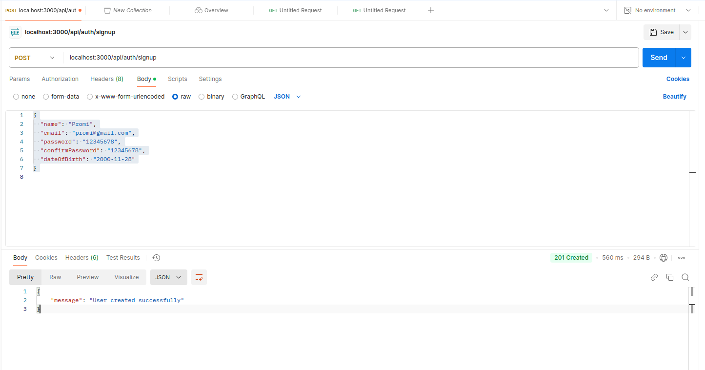

This is a [Next.js](https://nextjs.org) project bootstrapped with [`create-next-app`](https://nextjs.org/docs/app/api-reference/cli/create-next-app).

## Getting Started

First, run the development server:

```bash
npm run dev
```

Open [http://localhost:3000](http://localhost:3000) with your browser to see the result.

You can start editing the page by modifying `app/page.js`. The page auto-updates as you edit the file.

This project uses [`next/font`](https://nextjs.org/docs/app/building-your-application/optimizing/fonts) to automatically optimize and load [Geist](https://vercel.com/font), a new font family for Vercel.

## Testing Signup Backend in Postman

### 1. HTTP Method

**POST**

### 2. Endpoint URL

`http://localhost:3000/api/auth/signup`

### 3. Steps

- Open Postman.
- Set the request method to **POST**.
- Enter the endpoint URL in the URL field.
- In the **Body** tab:
  - Select `raw`.
  - Set the format to `JSON`.
  - Add the required signup data in JSON format, for example:
    `json
    {
      "name": "Promi",
      "email": "promi@gmail.com",
      "password": "12345678",
      "confirmPassword": "12345678",
      "dateOfBirth": "2000-11-28"
    }
    `

### 4. Send the Request

- Click **Send** and check the response for success or error messages.

### 5. Expected Response

- **On Success:**
  ```json
  {
    "message": "User created successfully"
  }
  ```
  
